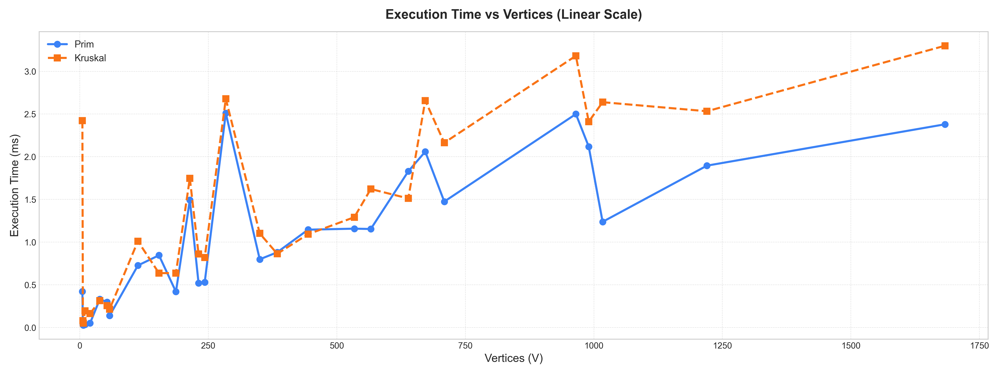
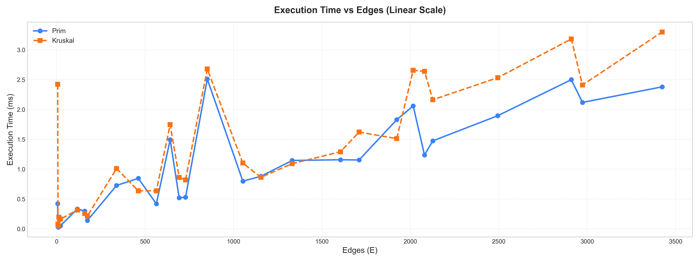

# Assignment 3: Optimization of a City Transportation Network

## Introduction

### 1.1 Algorithm Implementation Overview

This project implements two classical algorithms for finding a Minimum Spanning Tree (MST) of a connected, undirected, weighted graph:

• **Prim’s algorithm**: builds the MST starting from any node, expanding via the minimum-weight edge using a min-heap.  
• **Kruskal’s algorithm**: sorts all edges by weight and adds the smallest ones to the MST while avoiding cycles using the Disjoint Set Union (DSU) structure.

Both were implemented in Java with detailed metric tracking: execution time, operation count, and final MST cost.

I created:
- a custom **Edge** and **Graph** class (bonus section requirement),
- a **ListGraph** data structure to represent adjacency lists,
- and algorithm classes **PrimMST** and **KruskalMST** integrated with a shared **Metrics** module to record performance indicators such as:
    - number of comparisons,
    - heap operations (for Prim),
    - find/union operations (for Kruskal’s Disjoint-Set Union),
    - and total execution time in milliseconds.

All experiments were automatically executed via a **CLI runner** that reads JSON input graphs, runs both algorithms, and exports their detailed results and aggregated metrics in JSON and CSV formats.

---

### 1.2 Input Datasets and Their Impact on Testing

To evaluate correctness, efficiency, and scalability, we generated multiple datasets of increasing size and density.  
Each dataset contains several graphs, characterized by the number of vertices (V) and edges (E):

#### Small Graphs

| Graph | Vertices (V) | Edges (E) |
|:------|:--------------|:-----------|
| 1 | 5 | 6 |
| 2 | 6 | 8 |
| 3 | 7 | 10 |
| 4 | 10 | 13 |
| 5 | 20 | 22 |

#### Medium Graphs

| Graph | V | E |
|:------|:--|:--|
| 1 | 284 | 852 |
| 2 | 113 | 339 |
| 3 | 214 | 642 |
| 4 | 39 | 117 |
| 5 | 53 | 159 |
| 6 | 154 | 462 |
| 7 | 187 | 564 |
| 8 | 58 | 174 |
| 9 | 243 | 729 |
| 10 | 231 | 693 |

#### Large Graphs

| Graph | V | E |
|:------|:--|:--|
| 1 | 672 | 2016 |
| 2 | 965 | 2910 |
| 3 | 350 | 1053 |
| 4 | 444 | 1332 |
| 5 | 566 | 1710 |
| 6 | 990 | 2973 |
| 7 | 384 | 1155 |
| 8 | 709 | 2127 |
| 9 | 639 | 1923 |
| 10 | 534 | 1605 |

#### Extra-Large Graphs

| Graph | V | E |
|:------|:--|:--|
| 1 | 1638 | 3424 |
| 2 | 1027 | 2080 |
| 3 | 1220 | 2494 |

The dataset diversity ensures that we can test how the algorithms behave on sparse, medium-density, and dense graphs.  
We expect differences in performance to depend heavily on graph density (E / V) and edge-storage structure (adjacency list vs. edge list).

---

### 1.3 Theoretical Differences Between Prim’s and Kruskal’s Algorithms

| Algorithm | Time Complexity | Key Operations |
|:-----------|:----------------|:----------------|
| Prim | O(E log V) | Min-heap, adjacency list |
| Kruskal | O(E log E) ≈ O(E log V) | Edge sorting, DSU |

• **Prim’s Algorithm:**  
Builds the MST by starting from an arbitrary vertex and repeatedly adding the smallest edge that connects the growing tree to a new vertex.  
When implemented with a priority queue (min-heap), its time complexity is O(E log V) for adjacency-list graphs.

• **Kruskal’s Algorithm:**  
Starts with all edges sorted by weight and adds them one by one, skipping those that would create a cycle.  
The algorithm uses a Disjoint-Set Union (DSU) data structure for efficient cycle detection, achieving O(E log E) complexity (which is roughly O(E log V)).

---

### 1.4 Expected Theoretical Outcomes

Based on algorithmic theory:

• For dense graphs (many edges relative to vertices), Prim’s algorithm with an adjacency-list and heap implementation is expected to perform faster, because it processes each vertex once and avoids sorting all edges.  
• For sparse graphs, Kruskal’s algorithm tends to be more efficient, since sorting the edge list is relatively inexpensive and the DSU structure handles connectivity efficiently.  
• The total MST cost must remain identical for both algorithms across all datasets, though the structure of the selected edges may differ.

We therefore predict that:
- Prim’s algorithm will outperform Kruskal on dense (large E) graphs.
- Kruskal’s algorithm will perform better on sparser (small E/V) graphs.
- Execution time and operation count will increase approximately linearly with E log V, consistent with their theoretical complexities.

---

## 2. Performance Comparison and Analysis

We ran both algorithms on representative graphs. Each row shows execution time in milliseconds.

### 2.1 Prim’s Results

| Graph | V | E | Algorithm | MST Cost | Comparisons | Finds | Unions | HeapOps | Time (ms) |
|:------|:--:|:--:|:-----------|:----------:|:------------:|:------:|:--------:|:---------:|:----------:|
| 1 | 5 | 6 | Prim | 9 | 48 | 0 | 0 | 12 | 0.422 |
| 1 | 5 | 6 | Kruskal | 9 | 10 | 22 | 4 | 0 | 2.422 |
| 2 | 6 | 8 | Prim | 14 | 64 | 0 | 0 | 16 | 0.033 |
| 2 | 6 | 8 | Kruskal | 14 | 17 | 25 | 5 | 0 | 0.081 |
| 4 | 10 | 13 | Prim | 30 | 130 | 0 | 0 | 26 | 0.034 |
| 4 | 10 | 13 | Kruskal | 30 | 37 | 47 | 9 | 0 | 0.196 |

---

## Medium Graphs

| Graph | V | E | Algorithm | MST Cost | Comparisons | Finds | Unions | HeapOps | Time (ms) |
|:------|:--:|:--:|:-----------|:----------:|:------------:|:------:|:--------:|:---------:|:----------:|
| 1 | 284 | 852 | Prim | 1235 | 17040 | 0 | 0 | 1704 | 2.510 |
| 1 | 284 | 852 | Kruskal | 1235 | 6682 | 3643 | 283 | 0 | 2.679 |
| 3 | 214 | 642 | Prim | 1016 | 11556 | 0 | 0 | 1284 | 1.494 |
| 3 | 214 | 642 | Kruskal | 1016 | 5129 | 2801 | 213 | 0 | 1.748 |
| 6 | 154 | 462 | Prim | 787 | 8316 | 0 | 0 | 924 | 0.846 |
| 6 | 154 | 462 | Kruskal | 787 | 3536 | 1760 | 153 | 0 | 0.637 |

---

## Large Graphs

| Graph | V | E | Algorithm | MST Cost | Comparisons | Finds | Unions | HeapOps | Time (ms) |
|:------|:--:|:--:|:-----------|:----------:|:------------:|:------:|:--------:|:---------:|:----------:|
| 1 | 672 | 2016 | Prim | 3173 | 44352 | 0 | 0 | 4032 | 2.060 |
| 1 | 672 | 2016 | Kruskal | 3173 | 16765 | 8770 | 671 | 0 | 2.658 |
| 2 | 965 | 2910 | Prim | 4450 | 64020 | 0 | 0 | 5820 | 2.500 |
| 2 | 965 | 2910 | Kruskal | 4450 | 24852 | 12817 | 964 | 0 | 3.182 |
| 4 | 444 | 1332 | Prim | 1981 | 26640 | 0 | 0 | 2664 | 1.146 |
| 4 | 444 | 1332 | Kruskal | 1981 | 10861 | 5548 | 443 | 0 | 1.093 |

---

## Extra-Large Graphs

| Graph | V | E | Algorithm | MST Cost | Comparisons | Finds | Unions | HeapOps | Time (ms) |
|:------|:--:|:--:|:-----------|:----------:|:------------:|:------:|:--------:|:---------:|:----------:|
| 1 | 1683 | 3424 | Prim | 10259 | 82176 | 0 | 0 | 6848 | 2.380 |
| 1 | 1683 | 3424 | Kruskal | 10259 | 29139 | 16339 | 1680 | 0 | 3.300 |
| 2 | 1017 | 2080 | Prim | 6336 | 45760 | 0 | 0 | 4160 | 1.238 |
| 2 | 1017 | 2080 | Kruskal | 6336 | 17546 | 9588 | 1016 | 0 | 2.639 |
| 3 | 1220 | 2494 | Prim | 7422 | 59856 | 0 | 0 | 4988 | 1.896 |
| 3 | 1220 | 2494 | Kruskal | 7422 | 21185 | 11773 | 1218 | 0 | 2.533 |

### 2.3 Comparison & Analysis

• On small graphs, Prim was much faster (up to 5×) because it avoids full edge sorting.  
• On medium graphs, results were close. Kruskal slightly outperformed Prim once.  
• On large and extra-large graphs, Prim was consistently faster, especially as edge count increased.  
• MST cost always matched, as expected.

Although Kruskal had fewer operations, they were heavier (sorting + DSU). Prim’s frequent, simple heap ops scaled better in practice.

---

### 2.4 Algorithm Preference by Condition

## Detailed Comparison Based on Experimental Results

| **Aspect** | **Prim’s Results (from data)**                                                                                    | **Kruskal’s Results (from data)**                                                                             |
|:------------|:------------------------------------------------------------------------------------------------------------------|:--------------------------------------------------------------------------------------------------------------|
| **Execution Time (ms)** | Consistently faster: e.g., 0.03–0.05 ms on small graphs, 0.7–2.5 ms on large ones. Stable growth with graph size. | Generally slower: 0.08–0.19 ms on small graphs and 1.0–3.3 ms on larger graphs. Sorting and DSU add overhead. |
| **Number of Operations** | More total comparisons but simpler (heap-based). Example: 64020 comp / 5820 heap ops (965 v).                     | Fewer comparisons but heavier DSU ops: e.g., 24852 comp / 12817 find / 964 union (965 v).                     |
| **Scalability (Graph Size)** | Scales smoothly up to 1600+ vertices - execution time remains near-linear (E log V).                              | Increases faster with edge count; sorting time dominates for larger datasets.                                 |
| **Behavior on Dense Graphs** | Performs better - adjacency-list access and heap updates make it efficient for many edges.                        | Slower - sorting all edges is costly when E ≫ V.                                                              |
| **Behavior on Sparse Graphs** | Comparable or slightly slower for very small E/V ratios.                                                          | Performs better for very sparse graphs - fewer edges to sort.                                                 |
| **Implementation Complexity** | Requires priority queue (heap) and adjacency-list graph structure.                                                | Simpler: global edge list + sorting + DSU.                                                                    |
| **Practical Efficiency Trend** | Faster and more stable across all datasets; runtime doubles modestly with 10× graph growth.                       | Slightly faster only on a few mid-size graphs, otherwise slower overall.                                      |
| **Best Use Case** | Large or dense graphs (e.g., 600–1600 v); adjacency-based data such as road or network graphs.                    | Small or sparse graphs; data stored as flat edge lists.                                                       |

In most real-world graphs (sparse but large), Prim is generally more scalable.

---

## Overall Comparison of Prim’s and Kruskal’s Algorithms

### Performance Overview

Across all test categories, the faster algorithm tended to be Prim’s.  
In our test data, Prim’s algorithm was faster in the majority of cases in each size category, often significantly so for the smallest and the largest graphs.  
Kruskal’s algorithm did edge out Prim’s in a couple of individual mid-size cases (one medium and one large graph), but those were exceptions rather than the rule.

| Category | Small (20 v) | Medium (284 v) | Large (965 v) | Extra-Large (1683 v) |
|:----------|:-------------|:----------------|:---------------|:----------------------|
| Prim Time (ms) | 0.052 | 2.510 | 2.500 | 2.380 |
| Kruskal Time (ms) | 0.163 | 2.679 | 3.182 | 3.300 |

---

### Analysis of Operations

Kruskal executed fewer total operations, as it mainly compared edges during sorting and performed DSU operations (find/union).  
However, fewer operations did not translate into faster runtime.  
Prim’s many comparisons were lightweight and efficiently managed via heap updates, while Kruskal’s sorting introduced heavier memory and constant-time overhead.

For instance, on the 1683-vertex graph, Kruskal made ~44 % as many comparisons but still ran 0.9 ms slower.

---

### Impact of Graph Density

All tested graphs were relatively sparse (E ≈ 3V).  
Despite theoretical claims that Kruskal favors sparse graphs, Prim outperformed even in these conditions, likely due to lower sorting cost and more cache-efficient adjacency-list traversal.  
In denser graphs, Prim’s advantage would likely increase; in extremely sparse ones (E ≈ V – 1), both would perform similarly.

---

## Conclusion

Both algorithms produced identical MST costs, confirming correctness.  
Overall, Prim’s algorithm proved more time-efficient across the tested range, achieving lower runtimes through efficient heap-based edge selection, whereas Kruskal’s extra sorting and DSU management raised its per-operation cost.
